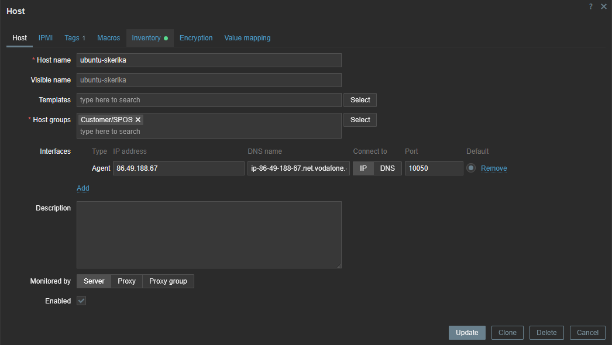

# zbx7-auto-reg

The independent work - Vagrant and Zabbix Agent2 7.0 LTS - Auto-registration to
[Zabbix pfSense](https://enceladus.pfsense.cz)

## Moje změny

- Vytvořil složku Zabbix a do ní vložil funkční Ubuntu server spolu se skriptem zabbix.sh, který nainstaluje a nastaví zabbix
- Pro přihlášení do ssh přes klíč do složky Zabbix přidejte soubor klic.pub
- Soubor zbx_export_hosts.yaml je export mého hosta
- Screenshot se nachází ve složce Images/zabbix-screenshot.png

